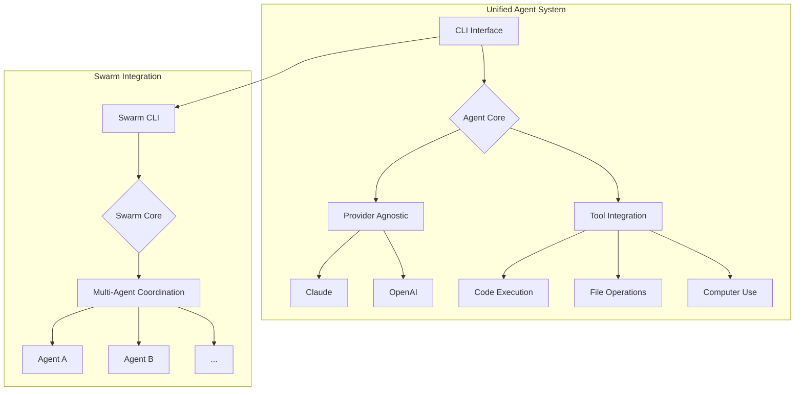

```mermaid
graph TD
    subgraph "Unified Agent System"
        A[CLI Interface] --> B{Agent Core}
        B --> C[Provider Agnostic]
        C --> D[Claude]
        C --> E[OpenAI]
        B --> F[Tool Integration]
        F --> G[Code Execution]
        F --> H[File Operations]
        F --> I[Computer Use]
    end

    subgraph "Swarm Integration"
        J[Swarm CLI] --> K{Swarm Core}
        K --> L[Multi-Agent Coordination]
        L --> M[Agent A]
        L --> N[Agent B]
        L --> O[...]
    end

    A --> J
```
